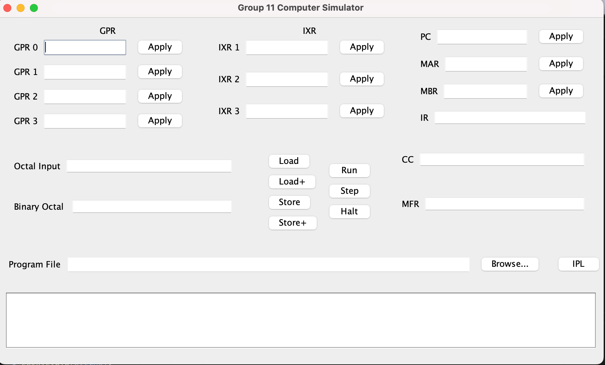

# HOW TO RUN

## REQUIREMENTS ##
Java 24 (JDK) installed on machine. See instructions here: https://www.oracle.com/java/technologies/downloads/

1. Open a terminal (bash/zsh)
2. Navigate to the terminal wherever the JAR file is downloaded: cd <...path to jar >
3. Run this command: 

 ```shell
 java -jar computer-simulator-1.0-SNAPSHOT.jar
 ```
4. When the terminal prompts you for a path to an assembler source file, enter the path. You may need to use an absolute path to the assembler source file.
5. Sim to your heart's content :). Test files with test output are located in /sourcefiles.

## USING SIMULATOR INTERFACE ##
The simulator interface looks like this. From left to right on the top, we see we have GPR inputs (general purpose registers), IXR inputs (index registers), the PC (program counter), 
MAR (the memory address register), MBR (memory buffer register), and IR (instruction register). In the middle, we see we have octal input (our main input field), as well as some control buttons (explained more below). Finally, the bottom section is occupied by a textArea that displays error or execution messages if applicable.


### PROVIDING INPUTS ###
All fields with an 'Apply' button next to them can have their value set via the Octal Value input. Enter your desired value in six-digit octal in the Octal Vaue input and click 'Apply' next to the desired field to change it.

### LOADING AND RUNNING FILE ###
The simulator accepts a two-column .txt load file output by our assembler to execute. 
1. Enter an octal value corresponding to the first address of your load file into the PC field.
2. Use the 'browse' button to select a load file. Sample load files are included in the 'sourcefiles' folder of this project.
3. After a file is selected, hit 'IPL'. This loads the load file instructions into simulated memory.
4. Hit 'Run'.

### LOADING AND STEPPING THROUGH A FILE ###
You can step through a load file to watch the discrete execution of each instruction. To do this,
follow Steps 1-3 in the "Loading and Running File" section above. Then, click 'Step'.

### LOAD ###
The load button allows you to load some value from memory given an address. To use this button, use the Octal Input to enter a value (0-2047) into the MAR. Then click 'Load'.

### LOAD+ ###
The load+ button is a utility that functions like the load button, but it increments the MAR by 1 after load is complete. To use this button, use the Octal Input to enter a value (0-2047) into the MAR. Then click 'Load+'.

### STORE ###
The store button allows you to store a value to some arbitrary place in memory. To use this button, use the Octal Input to enter a value into the MAR and MBR inputs, then click 'Store'.

### STORE+ ###
The store+ functions like the 'store' button, but it increments the MAR by 1 after store is complete. To use this button, use the Octal Input to enter a value into the MAR and MBR inputs, then click 'Store'.

### HALT ###
This button halts the execution of any running program.


